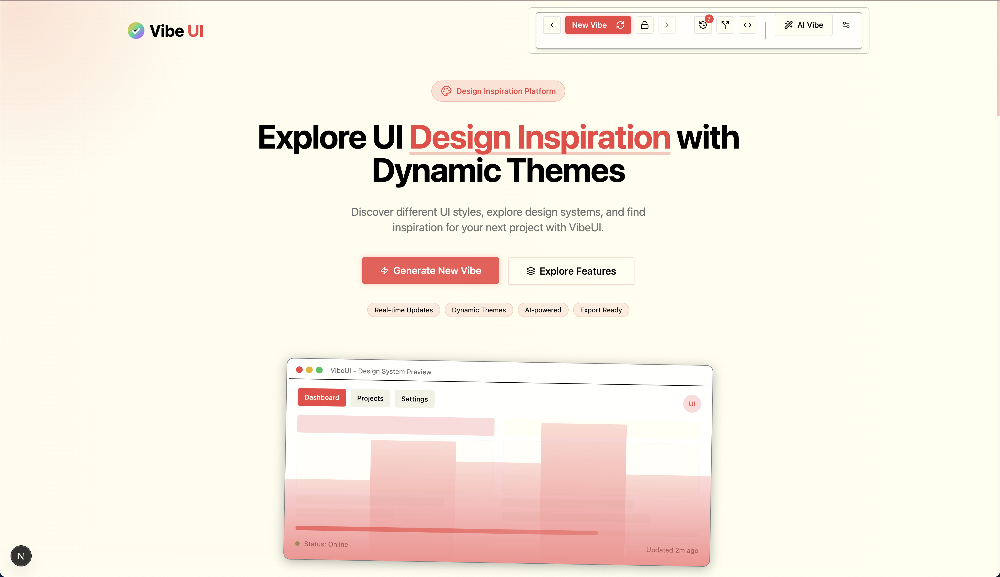

# VibeUI

<div align="center">
  
</div>
  
  **The Ultimate UI Design Inspiration Platform**
  
  [Features](#key-features) | [Getting Started](#getting-started) | [Documentation](#documentation)
  
</div>

## 🌟 Overview

VibeUI is a dynamic design system and UI inspiration platform that helps designers and developers discover new interface styles and aesthetics. It generates unique design "vibes" that can be customized, explored, and applied to your own projects.

With VibeUI, you can:
- Explore different design aesthetics from minimal to playful
- Generate design themes with a single click
- See live previews of UI components with your chosen vibe
- Experience smooth animations and transitions between themes

<div align="center">
  
</div>

## ✨ Key Features

- **Dynamic Vibe Generation** - Create and explore unlimited design styles
- **Real-time Preview** - See how components look with different vibes
- **Responsive Design** - Works on all devices from mobile to desktop
- **Performance Optimized** - Adaptive performance based on device capabilities
- **Dark/Light Mode** - Each vibe works with both dark and light color schemes
- **Animation Control** - Smooth transitions between different design states
- **Modern UI Components** - Showcase design across various interface elements

## 🚀 Getting Started

### Prerequisites

- Node.js (v16 or higher)
- npm or yarn
- Git

### Installation

1. Clone the repository:

```bash
git clone https://github.com/yourusername/vibeui.git
cd vibeui
```

2. Install dependencies:

```bash
npm install
# or
yarn install
```

3. Start the development server:

```bash
npm run dev
# or
yarn dev
```

4. Open your browser and visit `http://localhost:3000`

## 📖 Documentation

### Project Structure

```
vibeui/
├── public/          # Static assets including SVG logo
├── src/             # Source code
│   ├── components/  # UI components
│   ├── lib/         # Utilities and helper functions including vibe engine
│   ├── pages/       # Application pages
│   ├── hooks/       # Custom React hooks
│   └── styles/      # Global styles
```

### Vibe Engine

The core of VibeUI is the vibe engine, which generates and applies design themes. The engine consists of:

- `vibe-engine.tsx` - Context provider for vibe state
- `vibe-controls.tsx` - UI controls for manipulating vibes
- `vibe-demo-elements.tsx` - Showcase components for each vibe

### Component Showcase

VibeUI includes a comprehensive showcase of components that demonstrate each design vibe:

- Basic elements (buttons, cards, typography)
- Navigation and headers
- Interactive animations
- Layout examples

## 🔧 Usage Guide

### Generating New Vibes

1. Click the "Generate New Vibe" button to create a random design theme
2. See real-time updates on all components
3. Experience smooth transitions between different vibes

### Exploring Features

1. Scroll through the interface to see different component examples
2. Toggle between light and dark mode to see adaptability
3. Resize your browser to test responsive behavior

## 🛠️ Technologies Used

- **React** - UI framework
- **TypeScript** - Type safety
- **Next.js** - React framework
- **Tailwind CSS** - Utility-first CSS
- **Framer Motion** - Animations
- **shadcn/ui** - Component foundations

## 🤝 Contributing

Contributions are welcome! Please feel free to submit a Pull Request.

1. Fork the repository
2. Create your feature branch (`git checkout -b feature/amazing-feature`)
3. Commit your changes (`git commit -m 'Add some amazing feature'`)
4. Push to the branch (`git push origin feature/amazing-feature`)
5. Open a Pull Request

## 📄 License

This project is licensed under the MIT License - see the LICENSE file for details.

## 🙏 Acknowledgements

- [shadcn/ui](https://ui.shadcn.com/) for the component library foundations
- [Framer Motion](https://www.framer.com/motion/) for the animation library
- [Tailwind CSS](https://tailwindcss.com/) for the utility CSS framework
- [Next.js](https://nextjs.org/) for the React framework

---

<div align="center">
  Made with ❤️ by the VibeUI Team
</div>
